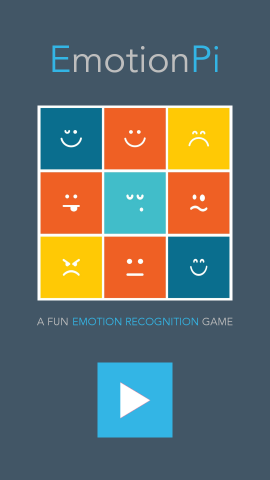
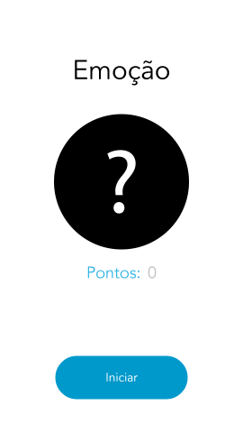
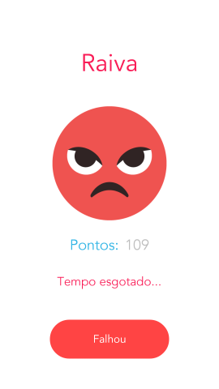

# EmotionPi
A fun emotion recognition game developed in Android. :smile:

Computer vision area has been growing up lately. Using technologies that realizes face detection and recognition is part of people's lives, whether in surveillance systems or even in everyday applications, such as digital cameras or mobile applications, for example. This repository addresses a computer vision system integrated with a mobile application.

It is a software, developed in C++ on the Raspberry Pi, which recognizes the emotion of a person from frames captured in real time by a camera. In parallel to this, a mobile application shows on its screen emojis for the user to reproduce in front of the camera.

         
    <h5 align="center">Screenshots from EmotionPi mobile app (I'm not that expert in UI, but I've got pretty satisfied :joy:)</h5>

The user's expression is classified as an emotion, by Raspberry Pi, and sent to the mobile phone. The mobile application checks if the emotion identified by Raspberry Pi is the same as requested. If it succeeded, it counts points to the user, otherwise the user loses points. After all, the application demands the next expression. The system topology is a client-server that all communication between devices is made through sockets. Raspberry Pi performs the function of a central server, responsible for the main processing and connection management, the clients are the players that connect to the server through the app.

The mobile app was developed in Java for the Android platform. However, the OpenCV library was used for the recognition of emotion in the server, because it has routines that help the pattern recognition. The emotions that it recognizes are simple: happy, anger, and neutral.

**OBS.: THIS REPOSITORY CONTAINS ONLY THE ANDROID PROJECT**

## License

This project is licensed under the Apache License - see the [LICENSE.md](LICENSE.md) file for details
